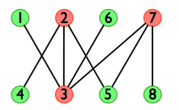

### Bipartite Minimum Vertex Cover

A Python implementation of finding the Minimum Vertex Cover of a Bipartite Graph with python & networkx using [Kőnig's theorem](https://en.wikipedia.org/wiki/K%C5%91nig%27s_theorem_(graph_theory) "Wiki Page"). You can then calculate the Maximun Independent Set if needed.

## Usage Example
'''python
import networkx as nx
def bipartite_minimum_vertex_cover(G:nx.Graph):

    M = nx.algorithms.bipartite.matching.maximum_matching(G)
    L = [k for k,v in G.nodes.items() if v['bipartite'] == 0]
    R = [k for k,v in G.nodes.items() if v['bipartite'] == 1]
    U = set(L) - set(M.keys())

    def bfs_alternating_paths(v, Z, find_match=False):
        Z.add(v)
        u = M[v] if v in M.keys() else None
        if find_match and u:
            bfs_alternating_paths(u, Z, find_match=False)
        elif not find_match:
            unmactched_neibors = [n for n in G.neighbors(v) if n != u]
            for n in unmactched_neibors:
                bfs_alternating_paths(n, Z, find_match=True)
        return

    Z = set()
    for u in U:
        bfs_alternating_paths(u, Z, find_match=False)

    K = set(L) - Z | set(R) & Z
    maximum_independent_set = set(G) - K
    return K

# Create a bipartite graph
G = nx.Graph()
G.add_nodes_from([1,2,6,7], bipartite=0)  # Set the left set of nodes
G.add_nodes_from([4,3,5,8], bipartite=1)  # Set the right set of nodes
G.add_edges_from([[1,3], [2,4], [2,3], [2,5], [6,3], [7,3], [7,5], [7,8]])  # Add edges

print(bipartite_minimum_vertex_cover(G))
# Output:
# {2, 3, 7}
'''

## Reference
- https://stackoverflow.com/questions/5919298/algorithm-for-finding-the-fewest-rectangles-to-cover-a-set-of-rectangles-without

- https://en.wikipedia.org/wiki/K%C5%91nig%27s_theorem_(graph_theory)

## Prerequisites
- NetworkX (version >= 2.0)

## Installation
Just Copy it to your project.
